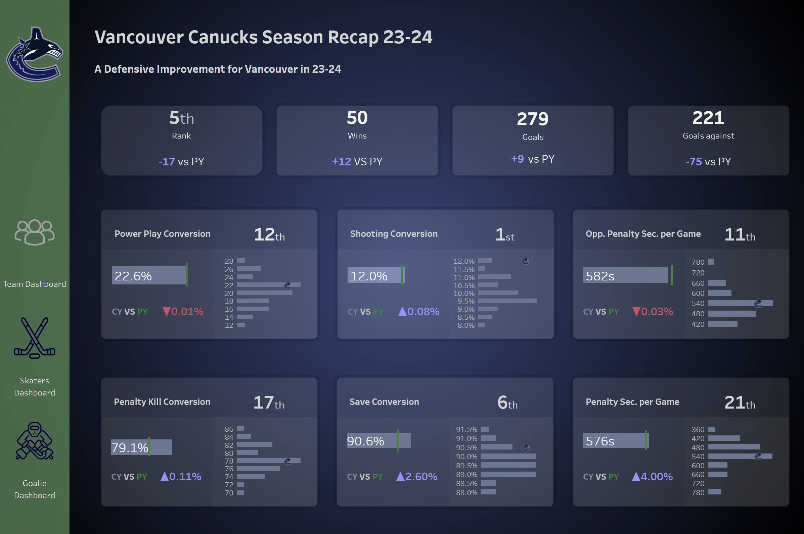

## Hi there 👋

| Hello there, welcome to my GitHub profile! My name is **Jules Claeys**.

## 🌼About me

I'm an Analytics Engineer Consultant at [***The Information Lab***](https://www.thedataschool.co.uk/blog/jules-claeys/). On my profile you will find my personal projects and tutorials I created or went through. You can also find my [Blogs](https://www.thedataschool.co.uk/blog/?ds=41&author=jules-claeys) and follow my journey through the Data world.

## 🐐 Achievements

* 1x Tableau VOTD Winner

* Shortlisted in Chelsea Design Competition

)

## 📸 Portfolio

* [Tableau Public](https://public.tableau.com/app/profile/jules.claeys/vizzes)

* [LinkedIn](https://www.linkedin.com/in/jules-claeys-66944b200/)

* CV *Soon*

| |  

## 🎈 Personal Projects

* [Hockey Shot Plot Turotial](https://github.com/julesclaeys/Shot-Plot-Tutorial-Hockey)

* [Git Hub Pages](https://julesclaeys.github.io/)

* [Bar Race JavaScript](https://julesclaeys.github.io/bar_race.html)

* [MSc Biodiversity Statistics in R](https://github.com/julesclaeys/Group-Project) 

## 🏆 GitHub Stats

